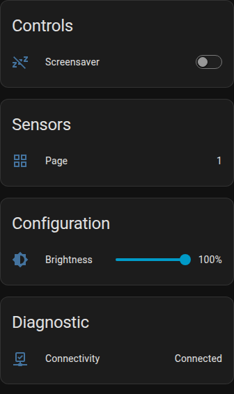
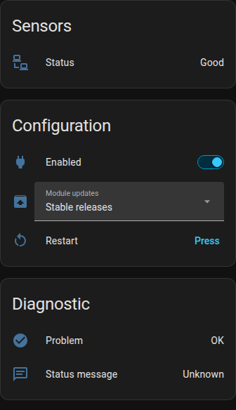

# Bitfocus Companion for Home Assistant

Control a [Bitfocus Companion](https://bitfocus.io/companion) instance from Home Assistant: Stream
Decks and the other surfaces it drives, and the module connections behind them. Dim a deck from an
automation, see which page it shows, watch a connection go bad and restart it.

<table>
<tr>
<td width="50%"></td>
<td width="50%"></td>
</tr>
</table>

One device per surface and per connection, both under a device for the Companion instance. Surfaces
are whatever Companion sees, such as Stream Decks, X-keys, Loupedeck and emulators. Connections are
the modules you configured, such as ATEM, OBS or vMix.

## Install

[](https://my.home-assistant.io/redirect/hacs_repository/?owner=FusselTV&repository=ha-bitfocus-companion&category=integration)

Or add it to HACS as a custom repository, category Integration:

```
https://github.com/FusselTV/ha-bitfocus-companion
```

Restart Home Assistant afterwards.

## Set up

Companion announces itself over mDNS, so it usually turns up on its own under **Settings → Devices &
services** and only asks which surfaces and connections you want. If it does not, use this button:

[](https://my.home-assistant.io/redirect/config_flow_start/?domain=bitfocus_companion)

Afterwards, **Configure** re-runs the device picker and sets the polling interval, and
**Reconfigure** changes host, port, TLS and token.

Companion cannot push, so this polls every 30 seconds and writes go out immediately. Surfaces and
connections you add or remove in Companion follow on the next poll.

## Blueprint

[](https://my.home-assistant.io/redirect/blueprint_import/?blueprint_url=https%3A%2F%2Fgithub.com%2FFusselTV%2Fha-bitfocus-companion%2Fblob%2Fmain%2Fblueprints%2Fautomation%2Fbitfocus_companion%2Fsurface_screensaver.yaml)

**Sleep Companion surfaces when nobody is around.**

Dims the surfaces you pick when everything you list as presence goes clear, and wakes them when
someone comes back. People, device trackers, motion and occupancy sensors all work, so it covers
leaving the house as well as leaving the room.

## Good to know

- Port 16622 is Companion's satellite port. The web interface, and this integration, want 8000.
- To check a token: `curl -H 'Authorization: Bearer cpn_admin' http://HOST:8000/api/v2/surfaces/v1`
- The logger is `custom_components.bitfocus_companion`.

## Known limitations

- It talks to Companion's REST API, which is experimental, off by default, and only in beta builds
  so far. Setup says so and links the
  [guide](https://github.com/FusselTV/ha-bitfocus-companion/wiki).
- Companion's tokens are fixed strings compiled into the app, not per-user secrets. Do not put an
  instance on an untrusted network because of this integration.
- State is at most one polling interval old. The page sensor is good for dashboards and conditions,
  less good as an automation trigger. Shorten the interval if you need one.
- Pressing buttons, switching pages and reading button state are not in the API.

## Remove

**Settings → Devices & services → Bitfocus Companion → Delete**. Nothing is left behind in Companion.

## Credits

The icon is Companion's own application icon from
[bitfocus/companion](https://github.com/bitfocus/companion) (MIT). Companion, Bitfocus and their
logos belong to Bitfocus AS. This integration is not affiliated with or endorsed by them.
